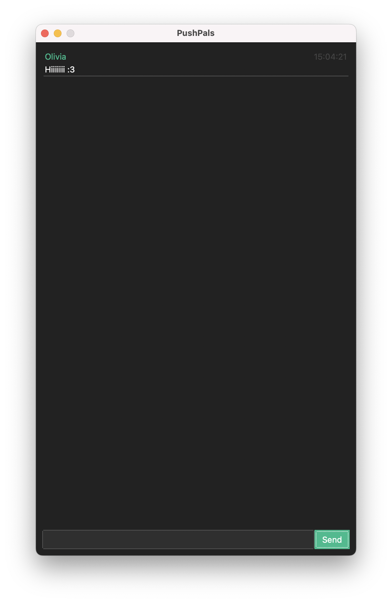

# PushPals

A messaging app that uses Git commits as messages! (finally right?)



### Features
- Each chat message is stored as a commit in a shared GitHub repository.
- Each member of the chat has their own file to avoid merge conflicts.
- All the Git mechanics are completely hidden from the user.

## Installation
1. **Download**: 
    - Get the latest release from the [Releases page](https://github.com/OliviaJespersen/PushPals/releases).
2. **Setup Config File**:
    - Find the config file at `\PushPals\_internal\config\config.json` and set it up as shown below.
3. **Setup or join a GitHub repo**
    - Start a new private repository on GitHub, and add the people you wan't to chat with as collaborators. 
4. **Run the App**: 
    - **Windows**: Launch the program by double-clicking the executable `PushPals.exe`. 

### Configuration
When you first open the config file you will be presented with a default configuration:
```json
{
    "auth_token": "Your github auth token goes here",
    "repo": "UserName/RepoName",
    "time_zone": "Europe/Copenhagen",
    "theme": "darkly"
}
```
> [!CAUTION]
> auth_token, repo and time_zone **CANNOT** be left as the default value and must be set.

**Options**:
- `auth_toke`: Your GitHub personal access token. You can read more [here](https://docs.github.com/en/authentication/keeping-your-account-and-data-secure/managing-your-personal-access-tokens).
- `repo`: The github repo for your chat.
- `time_zone`: Your time zone to be used for pytz.
- `theme`: The theme the program will be launched with. For a full list see the [ttkbootstrap documentation](https://ttkbootstrap.readthedocs.io/en/latest/themes/).
